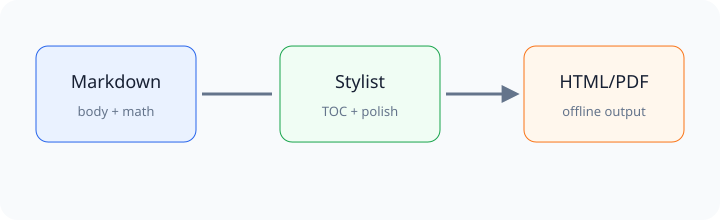

# 含目录与数学公式验收文档

> Author: Markdown Stylist
> Scenario: source TOC and manual TOC

[TOC]

## 手工目录

- [章节 Alpha](#章节-alpha)
- [重复章节](#重复章节)
- [Matrix Section](#matrix-section)

这段手工目录必须保留在正文原来的位置，不应被移动到侧边栏。

## 章节 Alpha

这里包含行内公式 $a^2+b^2=c^2$，以及希腊字母 $\alpha + \beta = \gamma$。

### 重复章节

第一处重复标题。

### 重复章节

第二处重复标题。

#### 展开层级 A

##### 展开层级 B

###### 展开层级 C

用于验证 H1-H6 层级缩进。

## Matrix Section

$$
\sqrt{x^2+y^2} = r
$$

$$
\begin{aligned}
f(x) &= \sum_{i=0}^{n} \frac{x_i}{1+i} \\
g(x) &= x^{2} + y_{0}
\end{aligned}
$$

$$
\begin{pmatrix}
1 & 0 & 0 \\
0 & 1 & 0 \\
0 & 0 & 1
\end{pmatrix}
$$

## Visual Elements

```sql
SELECT date, price
FROM day_ahead_market
WHERE province = 'Henan';
```

| Name | Status | Note |
| --- | --- | --- |
| Sidebar | Pass | independent |
| Body TOC | Pass | original position |

> 正式报告风格的引用块。


